<table width="100%" border="0" cellpadding="10" cellspacing="0">
  <tr valign="top">
    <td width="50%">
      
    </td>
    <td width="50%" rowspan="3">
      
    </td>
  </tr>
  <tr style="display: none"></tr>
  <tr>
    <td width="50%">
      
    </td>
  </tr>
</table>
<table width="100%" border="0" cellpadding="0" cellspacing="0">
  <tr valign="top">
    <td width="50%">
      
    </td>
    <td width="50%">
      
    </td>
  </tr>
  <tr style="display: none"></tr>
  <tr valign="top">
    <td width="50%">
      
    </td>
    <td width="50%">
      
    </td>
  </tr>
</table>
<picture>
  <source media="(prefers-color-scheme: dark)" srcset="assets/github-contribution-grid-snake-dark.svg" />
  <source media="(prefers-color-scheme: light)" srcset="assets/github-contribution-grid-snake.svg" />
  
</picture>

---

### Want to get in touch?

<!---->

...Coming soon.

